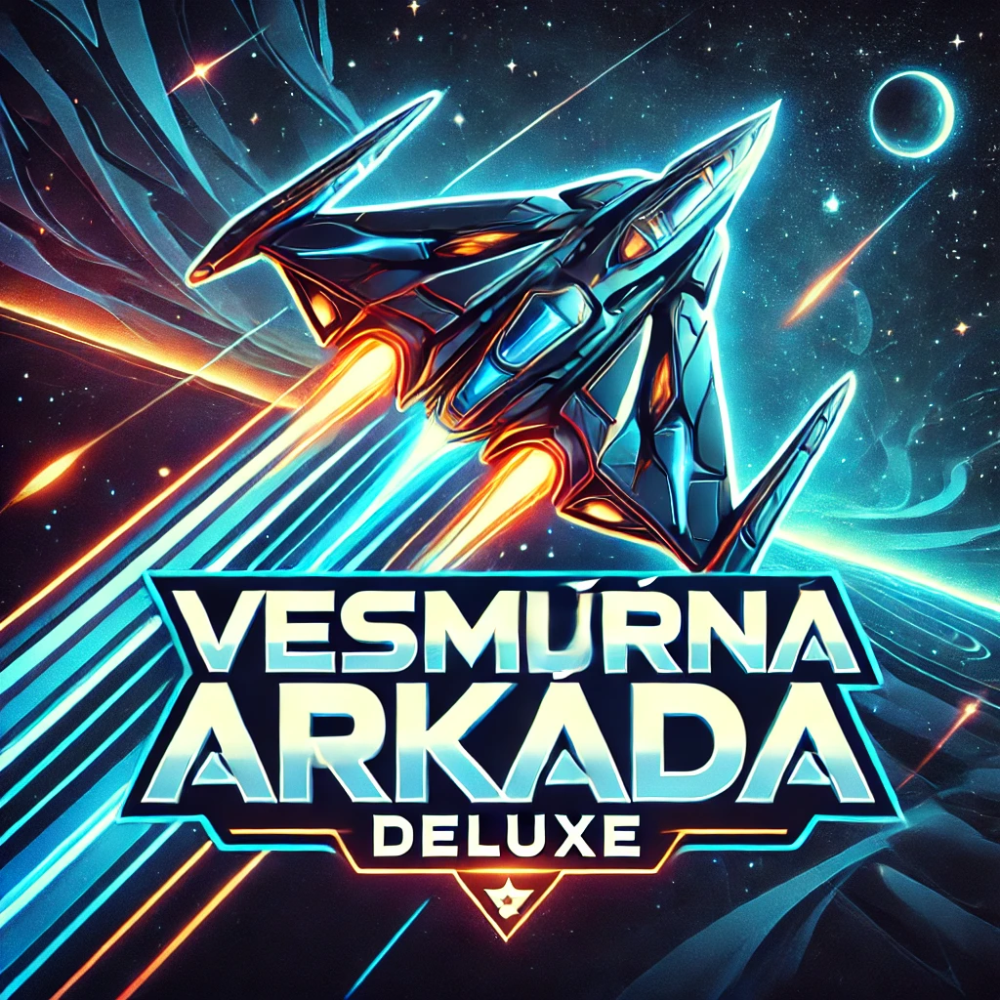

# Vesmírná Arkáda Deluxe

Vyzkoušej hru [zde](https://vesmirna-arkada-deluxe.netlify.app/)

## O hře

Vesmírná Arkáda Deluxe je akční vesmírná střílečka ve stylu arkádových her. Hráči ovládají vesmírnou loď, bojují proti vlnám nepřátel a sbírají power-upy, aby přežili co nejdéle a dosáhli co nejvyššího skóre.

## Hlavní funkce

- **Dynamický boj:** Prozkoumejte vesmír a bojujte proti různým typům nepřátel včetně bossů
- **Systém vylepšení lodí:** Odemykejte a vylepšujte různé typy vesmírných lodí, každá s unikátními vlastnostmi
- **Power-upy:** Získávejte speciální schopnosti jako štíty, zrychlení nebo výkonnější zbraně
- **Ultimátní schopnosti:** Aktivujte mocné ultimátní útoky pro zničení mnoha nepřátel najednou
- **Postupné vlny:** Čelíte stále obtížnějším vlnám nepřátel s rostoucí náročností
- **Herní ekonomika:** Získávejte body a nakupujte nové lodě v obchodě se skiny

## Jak hrát

### Ovládání

- **Pohyb:** Šipky nebo WASD
- **Střelba:** Mezerník (manuální) nebo CTRL (automatická)
- **Úhyb (Dash):** SHIFT + směr pohybu
- **Ultimátní schopnost:** Q
- **Použití lékárničky:** H
- **Pauza:** P

### Lodě

Hra nabízí několik typů lodí s různými statistikami:
- **Základní loď:** Vyvážená pro začátečníky
- **Rudá Fúrie:** Vyšší útočná síla, nižší zdraví
- **Přízračný Jezdec:** Delší úhyby, nižší poškození
- **Smaragdové Křídlo:** Vyšší zdraví a regenerace, redukce poškození
- **Zlatý Fénix:** Rychlejší nabíjení ultimátní schopnosti
- **Temná Hmota:** Vysoké poškození za cenu nižšího zdraví

### Nepřátelé

- **Základní nepřátelé:** Lehké jednotky s nízkým zdravím
- **Pokročilí nepřátelé:** Odolnější, vyšší poškození
- **Rychlí nepřátelé:** Extrémní rychlost pohybu
- **Minibossové:** Střední odolnost a speciální útoky
- **Bossové:** Hlavní nepřátelé s vysokým zdravím a pokročilými útočnými vzory

### Herní postup

1. Každá vlna přináší více a silnější nepřátele
2. Mezi vlnami se hráči částečně uzdraví
3. Každých několik vln se objeví boss
4. Po každé hře se skóre převádí na herní měnu
5. Herní měna může být použita k odemknutí nových lodí v obchodě

## Technické požadavky

- Webový prohlížeč s podporou HTML5, Canvas a JavaScript
- Doporučené prohlížeče: Chrome, Firefox, Edge (nejnovější verze)
- Zapnutý zvuk pro plný herní zážitek

## Instalace a spuštění

1. Stáhněte nebo naklonujte repozitář
2. Rozbalte všechny soubory do složky
3. Otevřete soubor `index.html` v podporovaném prohlížeči
4. Volitelné: Pro lepší zážitek spusťte na lokálním serveru

## Tipy a triky

- Mezi vlnami se automaticky regeneruje malé množství zdraví
- Ultimátní schopnost vás dočasně učiní nezranitelným
- Nepřátelští bossové nabízejí velkou odměnu a šanci na power-up
- Úhyby jsou klíčové pro vyhnutí se nepřátelským projektilům
- Lékárničky si ukládejte na těžší vlny

## O projektu

Vesmírná Arkáda Deluxe je HTML5 hra vytvořená s použitím čistého JavaScriptu a Canvas API. Hra demonstruje implementaci klasických herních mechanik arkádových stříleček ve webovém prostředí.

## Credits

Vytvořil: [Jméno autora]
Grafika: Vytvořena proceduálně pomocí Canvas
Zvuky: [Zdroj zvuků]